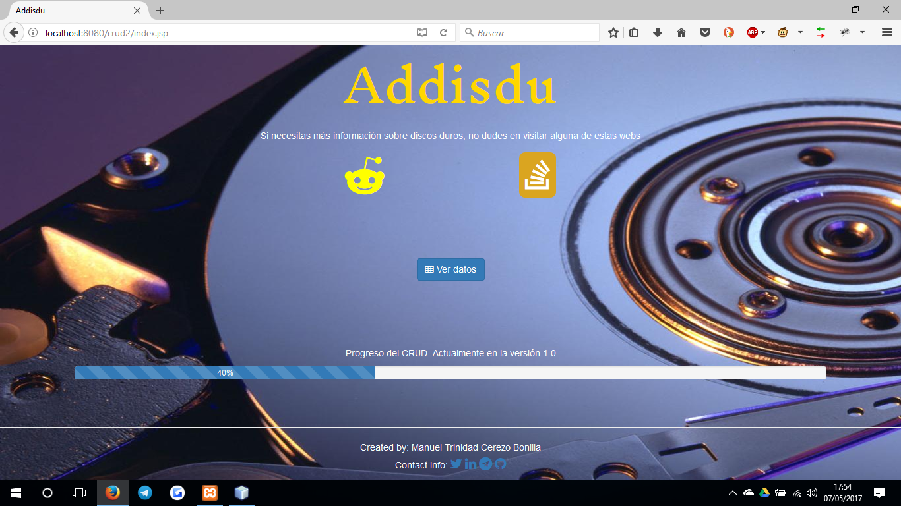
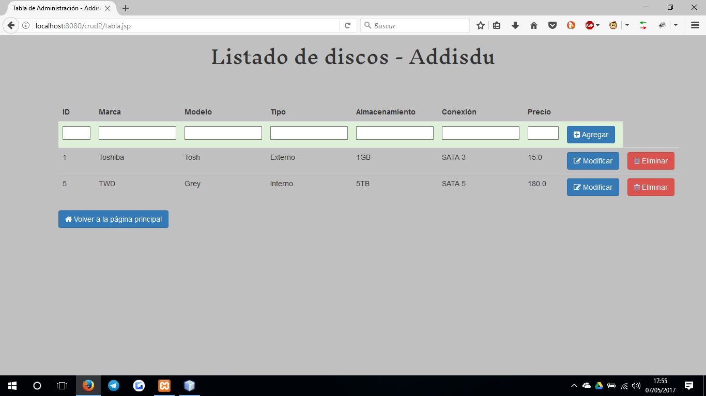
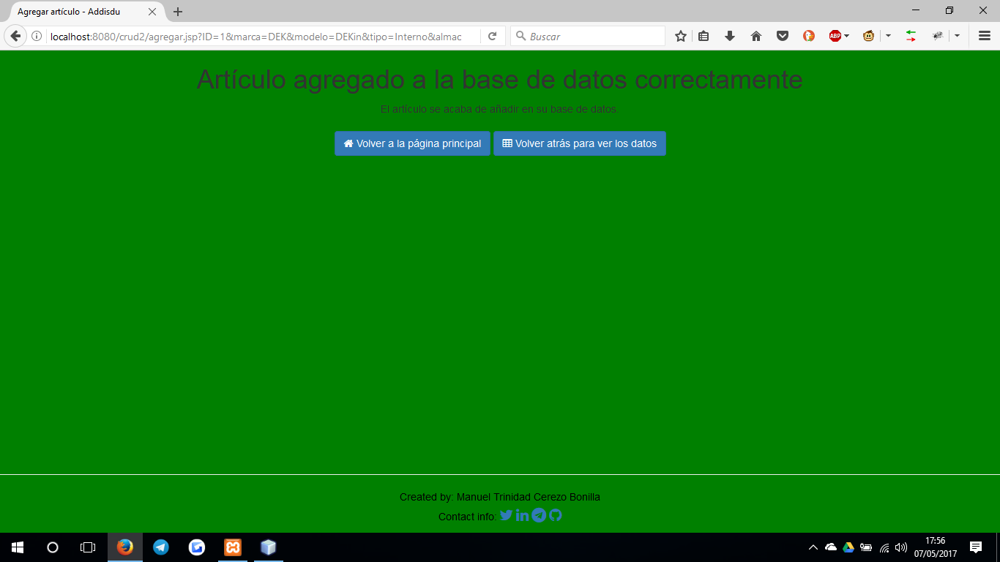
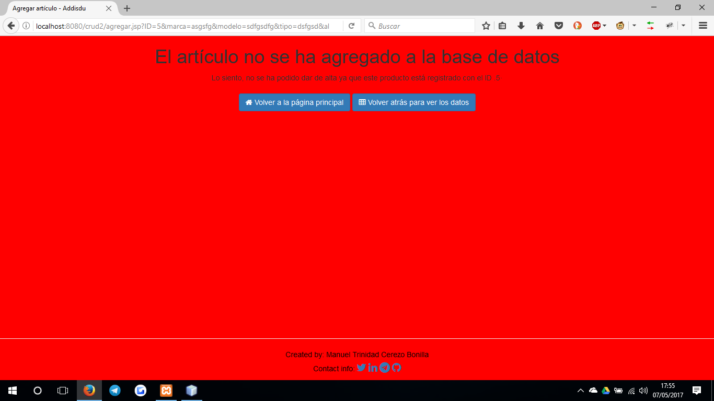
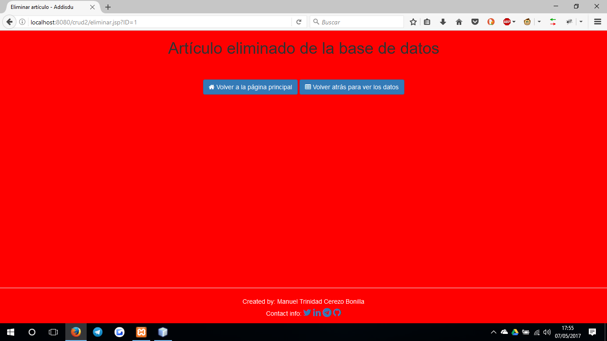

# CRUD JSP de Administrador de stock
### Addisdu (Administrador de Discos Duros)

> Proyecto de clase de las asignaturas de Programación y Sistemas Informáticos

# 👽 Página principal

 

# 🚀 Tabla con los datos

 

# 🚦 Acciones en la tabla

 

# 🎨 TODO

- [X] Crear base de datos y darle un funcionamiento a la misma
- [X] Crear un diseño básico que sea sencillo de entender
- [X] Creado un footer para método de contacto
- [] Mejorar el diseño
- [] Mejorar las querys para conseguir más datos sobre el stock
- [] Añadir 'charts'(funciones y gráficas) interactivas con la información de la base de datos
